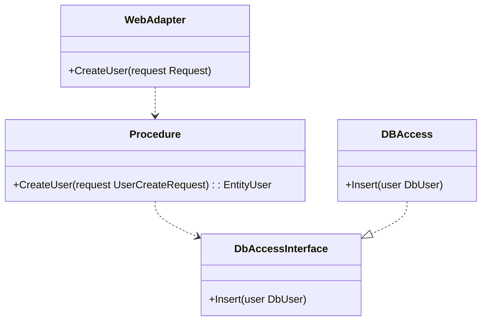
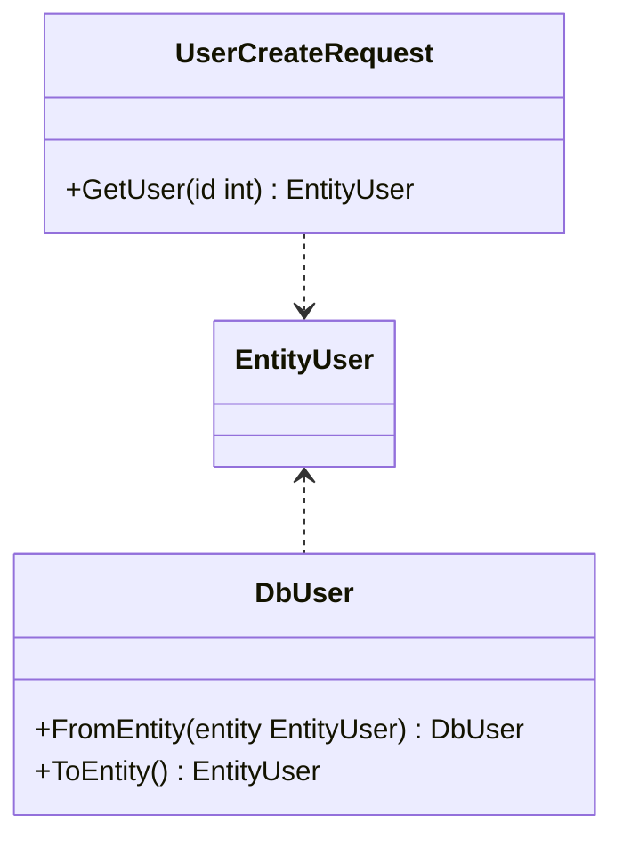
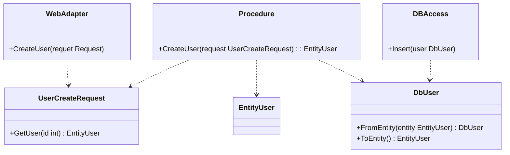

## 導入
ぶっちゃけクリーンアーキテクチャの書籍は1ページも読んだことがないのだが、自分で考えた実装パターンの説明にちょうどよさそうなので、概念を拝借したい。  
Webの記事などは読んでいるので、そう理解が間違っているとは思っていないが、間違っていたらご指摘願いたい。  

ということで、個人的に有用だなと思った実装パターンを検討したので、解説していく。  
まずは用いる単語を整理した後に、どのような課題を解決したいのか、解決案としての実装パターン、それを適用したときのアーキテクチャ概要などに言及した後に、運用上でてきそうな課題、Pros/Consなどを述べていく。  
また、基本的にサンプルコードはGo言語を用いるが、他の言語でも同様のことはできるはずなので、本記事は言語に依存しない話題である。  

## 言葉の整理

### Data Transfer Object (DTO)
`Pattern of Enterprise Application Architecture`いわゆるPoEAAだが、日本語訳を有志で公開されているページがあったので引用させていただく。  
[データ転送オブジェクト](https://bliki-ja.github.io/pofeaa/DataTransferObject)  

リモートファサードのような、ネットワークあるいはプロセス跨ぎのコミュニケーションを行う場面が想定されているようだ。  
細かい関数を何度も呼び出すのは使用感として悪いので、ファサードを用意し、それらの値をまとめて返却する。その時にまとめる役割がData Transfer Object(以降DTO)であると。  
また、シリアライズ可能ともある。これはロジックを持たない値と捉えても良さそうではある。  

Wikipediaにもページがあり、そちらには`DTO が自身のデータの格納と取り出し機能しか持たない`ともある。  
[Wikipedia DTO](https://ja.wikipedia.org/wiki/Data_Transfer_Object)  

これ以上は詳しい方に解説いただきたいが、よく聞くのは、`ロジックを持たない`、それゆえ`データを運ぶ`役割のみに利用されるという説明だ。  

とりあえず、なんとなくのイメージはついたのでは無いだろうか。  
本記事のタイトルは、`Data Transfer Objectを拡張してクリーンアーキテクチャの同心円の図を立体的に捉える`だが、このDTOの概念を拡張した新しい概念を定義し、より役割を持たせて、さらに利用場面を限定するような実装パターンの紹介である。  

### クリーンアーキテクチャの同心円の図
クリーンアーキテクチャといえば、この図。この図こそクリーンアーキテクチャ。という印象があるのでは無いだろうか。  

[The Clean Architecture](https://blog.cleancoder.com/uncle-bob/2012/08/13/the-clean-architecture.html)から引用

書籍を読んでいないので厳密な言及はさけさせていただくが、zennにも数多あるクリーンアーキテクチャの解説記事によると、依存関係の方向性を定めることが重要と言及されることが多い。  

図では4つのレイヤを定義している。  
- Enterprise Business Rules
- Application Business Rules
- Interface Adapters
- Frameworks & Drivers

本記事は、これらすべてのパーツをクリーンアーキテクチャになぞったコードで説明するわけではない。
ただ、先程も言及した通り、役割ごとにモジュールを分割し、その依存の方向性を調整するという点においては、参考にしたコードを想定する。  

本記事のタイトルは、`Data Transfer Objectを拡張してクリーンアーキテクチャの同心円の図を立体的に捉える`だが、クリーンアーキテクチャの図で最も重要であろう依存関係はそのままに、新しい構造を提案する形になる。  

### Entityと手続きロジック
クリーンアーキテクチャの図の中で、本記事で利用させていただく単語は`Entity(Entities)`のみだ。他は筆者が定義が曖昧なので利用は避ける。  
ただ、`Use Cases`や`Controllers`のようなコードは出てくるだろう。これは単に`手続きロジック`と呼びたい。  

図によるとEntityは、どこにも依存しないプレーンなオブジェクトだ。データ構造に付随するロジックを持つ。どこにも依存していないので、気にせず変更することができる。逆に言えば、Entityの変更は他のモジュールにも波及しやすそうではある。  
Entityは、例えば、独自型を持つこともあるかもしれない。Goだと以下のように定義できる。  
```Go
type Name string
```

たとえば`Name`型を作る前に文字数制限のバリデーションを入れておけば、`Name`型は文字数制限が守られた型として認識できる。いわゆる`Value Object`というやつだが、これはどこにも依存していないからこそできることだ。  
たとえば、db schemaにnameカラムがあり、そのカラムに対応した値であることはGoでは以下のように表現できる。  
```Go
type User struct {
    name string `db:"name"`
}
```

このようなときは`name`項目は`Name`型とするのは難しいだろう。

Entityを取り回して扱うコードを、ここでは`手続きロジック`と呼びたい。Entityだけでは実現が難しい動的に確認すべき制約を実現したり、データの保存を指示するなどのロジックを持つものだ。  
クリーンアーキテクチャの図で言うと、`Use Cases`や`Controllers`に該当しそうだが、本記事では厳密な定義が不要で、かつ依存の方向性のみが明確になっていればよいので、`手続きロジック`と呼ばせてもらう。  

### RepositoryとDBアクセスモジュール
`Repository`に関してもPoEAAの日本語訳を参照させていただく。  
[Repository](https://bliki-ja.github.io/pofeaa/Repository)  

DBアクセスモジュールに一枚抽象レイヤを足して、ドメインオブジェクトをやり取りする役割と定義されている。つまりDBアクセス自体は別途存在し、それをラップして使いやすくしたものということだ。  
本記事ではEntityをどこにも依存しないと述べた。DBのことも知らないだろう。したがって、Repositoryは引数、返り値にEntityを持ち、DBアクセスなどを抽象化する役割と見ていいだろう。  
PoEAAの定義では、Repositoryにおいては、Entityとdbのデータモデルのマッピングがなされるともある。これは記事の後半において、課題感として取り上げる。  

## 背景としての課題
用語の整理をしてきたが、ここからが本題になる。  

新しい実装概念を利用するには背景となる課題が必要だ。まずは、これまでで定義した`Entity`と`手続きロジック`のコードを以下に示す。  

まずはEntityだ。  

```Go
package entity

import (
    "strings"
    "errors"
)

type Name string

func NewName(name string) (Name, error) {
    var trimmed = strings.TrimSpace(name)

    if trimmed == "" {
        return Name(""), errors.New("name should not be empty")
    }

    var length = len([]rune(trimmed))
    if length < 1 || length > 255 {
        return Name(""), errors.New("name must be between 1 and 255 characters")
    }

    return Name(trimmed), nil
}

type User struct {
    Id   int
    Name Name
    Age  int
}

func NewUser(id int, name Name, age int) *User {
    return &User{
        Id:   id,
        Name: name,
        Age:  age,
    }
}
```

また、以下は手続きロジックだが、Google翻訳で手続きは`procedure`だったので、package名としている。  

```Go
package procedure

import (
    "entity"
    "request"
    "idCreator"
    "repository"
)

type UserCreate struct {
    UserRepository repository.UserRepository
}

func NewUserCreate(repo repository.UserRepository) *UserCreate {
    return &UserCreate{
        UserRepository: repo,
    }
}

func (creator UserCreate) CreateUser(request request.UserCreateRequest) (*entity.User, error) {
    id, err := idCreator.create()
    if err != nil {
        return nil, err
    }

    name, err := entity.NewName(request.Name)
    if err != nil {
        return nil, err
    }

    age := request.Age

    user := entity.NewUser(id, name, age)

    if err = creator.UserRepository.Save(user); err != nil {
        return nil, err
    }

    return user, nil
}
```

コードは省いているが、`UserCreateRequest`はプレーンなオブジェクトで、Webインタフェースなどから入ってきた値を保持しているDTOである。  
`idCreator`なるモジュールはidは発行してくれるモジュールだ。本記事の本筋とは関係ないので、簡易な形を取っている。  

筆者の課題感は、この`UserCreateRequest`から値を取り出すコードだ。サンプルコードでは6行ある。  

```Go
    name, err = entity.NewName(request.Name)
    if err != nil
        return nil, err
    }
    age = request.Name
    user = entity.NewUser(id, name, age)
```

筆者はこのコードは粒度が合っていないと感じる。`idCreator`がidを発行するのは、なにかどこかからidを生成しているだろう。その後に`request`から値を取り出し、DBに保存するわけだ。  
だが、この取り出しという部分に、6行費やしている。

サンプルで用いた`User`構造体は、項目が3つしかないが、これが100項目を持つ構造体だとしたらどうだろうか？100項目がフラットに並ばず、階層構造的になっていたとしても、その部分のハンドリングは非常にめんどうだろう。  
すくなくとも、手続き的な記述を記載する`procedure`の名前空間にこの記述を置くのは、手続き的な記述に、データモデルの記述が混ざっており、コードの粒度があっていないように感じる。  
この課題を解決したい。  

## 実装
ここからが、この記事の本題となる。先程、説明を省いた`UserCreateRequest`の実装から見ていく。

```Go
type UserCreateRequest struct {
    Name string `json:"name"`
    Age  int    `json:"age"`
}
```

こんな感じだろうか。Go言語は構造体のtag情報(上記では`json:"name"`の部分)を利用してHttp Requestやjsonの中身を、構造体にマッピングするライブラリが多く存在する。  
`UserCreateRequest`の場合は、jsonデータを想定しているが、formの値などもマッピングして利用できる。  
JavaScript/TypeScriptの場合なら、Schema Validatorと呼ばれるものだ。Zodなどのライブラリが有名で、入ってきたjsonデータを特定の構造体の型であるか検査してくれる。  

この`UserCreateRequest`を拡張して使う。具体的にこうする。  

```Go
package request

import (
    "entity"
)

type UserCreateRequest struct {
    Name string `json:"name"`
    Age  int    `json:"age"`
}

func (req UserCreateRequest) GetUser(id int) (*entity.User, error) {
    name, err := entity.NewName(req.Name)
    if err != nil {
        return nil, err
    }

    age := req.Age

    return entity.NewUser(id, name, age), nil
}
```

DTOの機能としてEntityへの変換の役割を持たせている。入力データモデルが持っていない`id`は引数に受け付けることで取得している。  
具体的には事前に粒度があっていないと述べていた関数をそのままこちらに移してきた形となる。これを利用すると手続きロジックはこう書ける。  

```Go
package procedure

import (
    "entity"
    "request"
    "idCreator"
    "repository"
)

type UserCreate struct {
    UserRepository repository.UserRepository
}

func NewUserCreate(repo repository.UserRepository) *UserCreate {
    return &UserCreate{
        UserRepository: repo,
    }
}

func (creator UserCreate) CreateUser(request request.UserCreateRequest) (*entity.User, error) {
    id, err := idCreator.create()

    user, err := request.GetUser(id)
    if err != nil {
        return nil, err
    }

    if err = creator.UserRepository.Save(user); err != nil {
        return nil, err
    }

    return user, nil
}
```

どうだろうか。`User`モデル内の個別の要素、特に`Name`は変換時に長さチェックが入るわけだが、そういった記述を含めて`request`パッケージに追いやったことで、細かい記述が消え、処理の流れの粒度が揃ったように感じられる。  
今までは`Name`だの`Age`だのという情報が混ざっていたが、修正後は`request`から`User`を取得して`repository`で保存する。という文章を表すコードに近くなった。

また、`request`packageのメソッドである`GetUser`が`error`を出す可能性があるのであれば、それは入力値の問題だろう。それも`procedure`のコードから想像できそうだ。  
バリデーション自体は、`entity`packageの`NewName`関数が担っている。文字数の制限というのは`Name`型の制約だからだ。そのロジック自体はどこにも漏れていない。単に、`request`packageで、`entity`packageの構造体に変換しただけだ。  

またEntityが何にも依存していないという状況は変わっていない。  
個別の項目については`UserCreateRequest`と`User`のコミュニケーションに閉じているので、例えば`Origin`(出身国)のような項目を追加したいときに`procedure`のコードを変更する必要もない。

繰り返しになるが、`User`オブジェクトは項目が3つしかない。項目数が多いものを扱うときには大変になるはずだ。階層構造的な構造体とするのであれば、構造体ごとに変換メソッドを持たせて呼び出すこともできる。  
手続きロジックの中で個別の項目を取り扱うよりは見通しがよくなるはずだ。  

## そもそも詰め替えしないという選択肢について
ここまでで、それならDTOからEntityへの詰め替え自体しなくていいのでは？と思う方もいるかも知れない。  
たとえば、`UserCreateRequest`が以下の実装だったらどうだろうか？  

```Go
package request

import (
    "entity"
)

type UserCreateRequest struct {
    Name string  `json:"name"`
    Age  int     `json:"age"`
    preview bool `json:"is_preview"`
}

func (req UserCreateRequest) GetUser(id int) (*entity.User, error) {
    name, err := entity.NewName(req.Name)
    if err != nil {
        return nil, err
    }

    age := req.Age

    user = entity.NewUser(id, name, age)
}
```

`preview`は試しにuserを作ったらどうなるか、やってみる機能が必要になったという要件で追加してみた。  
これは明らかに保存される値ではないが、入力値としては重要である。  
つまり`entity.User`とはデータ型が違うのである。  

もちろん、データ構造に手を入れたりすることで、詰め替えをせずとも上記を改善することもできるが、筆者個人の経験としてはある程度システムが複雑になってきたときに、詰め替える仕組みがあったほうが整理しやすい。  
このあたり、納得感が無いのであれば、それはそれでいいだろう。ただ本記事は、詰め替えるという状況があるうえで、どう工夫したほうがよいか？というテーマだ。  

## Outboundな処理への適用
これまでは、入力パラメータに`UserCreateRequest`というデータモデルを適用し、変換関数をもたせるという形をもって実装パターンとしてきた。言うなればシステムに入ってくるInboundなデータ処理で適用させてきたわけだ。  
これが入力パラメータ(Inbound)ではなく、システムから出ていくDB schemaのデータモデル、つまりOutboundなデータであれば、どのようにできるだろうか？  

そもそもこの記事は、Entityはどこにも依存しない、つまりDB Schemaのことを知らないという前提の記事だ。このことは、詰め替えの是非について既に述べた。  
では今度は、`request`packageと同様に、DBのデータモデルに、Entityへ変換する関数を持たせてみる。  

```Go
package db

import (
    "entity"
)

type User struct {
    Id   int    `db:"id"`
    Name string `db:"name"`
    Age  int    `db:"age"`
}

func FromEntity(entity *entity.User) *User {
    return &User{
        Id:   entity.Id,
        Name: string(entity.Name),
        Age:  entity.Age,
    }
}

func (user User) ToEntity() (*entity.User, error) {
    name, err := entity.NewName(user.Name)
    if err != nil {
        return nil, err
    }

    return entity.NewUser(user.Id, name, user.Age), nil
}
```

こういう構造になってくると、Repositoryは存在意義が怪しい。ここでRepositoryはEntityを引き受けてdbのデータモデルに変換する役割を持っているはずのものだからだ。  
DB schemaのデータモデル自身が、Entityへの変換関数を持っているのであれば、わざわざRepositoryにEntityを渡す必要はなく、単にEntityをdbモデルに変換し、直接DBアクセス関数を呼んでやればよい。  

```Go
package procedure

import (
    "entity"
    "request"
    "idCreator"
    "db"
    // "repository"
)

type UserCreate struct {
    DB db.UserDB
}

func NewUserCreate(db db.UserDB) *UserCreate {
    return &UserCreate{
        DB: db,
    }
}

func (creator UserCreate) CreateUser(request request.UserCreateRequest) (*entity.User, error) {
    id, err := idCreator.create()

    user, err := request.GetUser(id)
    if err != nil {
        return nil, err
    }

    dbUser := db.FromEntity(user)
    err = creator.DB.Insert(dbUser)
    if err != nil {
        return nil, err
    }

    return user, nil
}
```

つまり解釈としては、RepositoryがEntityを出し入れするというのであれば、RepositoryというのはDBアクセス役割の`Insert`関数と、変換役割の`FromEntity`関数を混ぜて使っているものと考えることもできそうだ。  

仮にdbに`ToEntity`関数を実装しないのであれば、データ取得を行う`repository#GetUser`はこんな実装なのではないだろうか。  

```Go
package repository

import (
    "entity"
    "db"
)

func GetUser(id int) (*entity.User, error) {
    dbUser, err := db.GetUser(id)
    if err != nil {
        return nil, err
    }

    name, err := entity.NewName(dbUser.Name)
    if err != nil {
        return nil, err
    }

    return entity.NewUser(dbUser.Id, name, dbUser.Age), nil
}
```

上記はDB schemaのデータモデル取得と、変換の処理が混ざっている状態だ。  
そして、その変換とデータ取得が混ざった状態のコードは、責務の多いコードといえるだろう。  
どちらがいいとは言わないが、repositoryを使えば責務が混ざるが、DTO(ここでは`db.User`)で変換ロジックを実装すれば、混ざらないようにすることができる。  

## クリーンアーキテクチャの同心円の図を立体的に捉える
これまでinbound/outboundに渡って、DTOを拡張した構造体によって、データモデル同士のやり取りと、手続き的な処理の流れを分離させてきた。  
ここでは、一旦実装から視点を遠ざけて、この構造体で実現しているアーキテクチャを明らかにしていきたい。  

クラス図で記載してみる。  
まず、処理の流れを示す手続き部分のモジュールの依存関係だ。  



処理の上では、全体の手続きが記載された`Procedure`は、interfaceを介しているので、`DBAccess`の実装に依存していない。これは依存性の逆転というテクニックだが、クリーンアーキテクチャの依存関係を構築するためには必要なテクニックだろう。  
上記のクラス図は、クリーンアーキテクチャの同心円の図が示す依存の方向を守っている構成だ。  

これが更にデータモデルでも、依存の方向が同じになる。  



`UserCreateRequest`はInboundなデータで、`DBUser`はOutboundなデータであり、それぞれが`WebAdapter`、`DBAccess`に対応している。  
`EntityUser`はどこにも依存がないが、`DBUser` `UserCreateRequest`は`EntityUser`を知らなくてはならない。  

手続き的なコードだけではなく、データモデル上も同様の依存の方向となる。  
前段で示した例はRepositoryのレイヤも消えるので、レイヤ階層は浅くなるが、モデルどうしにもレイヤの考え方が適用される。  

筆者は、これを示して、クリーンアーキテクチャの同心円の図を立体的に捉える。と述べている。タイトル回収だ。  
ちなみに、手続きコードからモデルへはこのような依存関係となっている。  



## いつ使うのか
ここまででRepositoryを否定するような論調で文章が進んできたわけだが、筆者の主張としてはRepositoryをやめろとは考えていない。  
そうではなく、このようなパターンを実装の引き出しに入れておくと便利だと言いたいわけだ。  

このDTOを拡張したオブジェクトは、実際には入力パラメータのハンドリングの際に便利なものだろう。  
これまで述べてきた`UserCreateRequest#GetUser`関数は`id`を引数にとるのだが、これは入力パラメータと、Entityの関係をよく表している。  
入力パラメータにおいては`id`がないが、データモデルとして完全な状態となるべくEntityには必要な値になる。この完全性が損なわれているデータモデルからの変換においては、変換関数が使いやすい。  

だが、DB schemaのデータモデルを見てみると、当然ながら`id`を持っているし、`Name`に関してもDBに値を入れる段階で256文字以下であるというバリデーションを行っているはずであろう。  
つまり、DB schemaの時点では完全性が成り立っており、わざわざ変換関数を用いたり、バリデーションを行わなくても、素直に読み替えてしまえばいいという考え方もあり得るだろう。  

例えば外部のWeb APIにアクセスして、完全性が成り立たないデータを取ってくる場合は、バリデーションや変換ロジックも必要になるかもしれない。これはoutboundな処理であってもそういった特性を持つ可能性があるのだ。  
そもそも筆者がこれを思いついたのは、kvsから取り出した階層構造のデータに、値次第でロジックを付け足すというRepositoryを作ったことで思いついた。  
値次第でロジックをつけるので、変換関数が必要だったわけだが、そのせいでRepositoryが肥大化したのでDTOに機能を移した。そしてRepository自体を剥がして今の形となったのだ。  

このあたりを考慮に入れながら、本記事で紹介した実装パターンを適用すればよいだろう。  
筆者は仕事で、とにかく項目の多い構造体をハンドリングする必要があり、こういった実装パターンも適用できるイメージを持っているが、そうではない読者もいるかもしれない。  

## データモデルの変更に際したケアについて
Repositoryを否定しているわけではないことは述べたが、Repositoryが担っていた、重要な役割をここで検討しておく必要がある。  
Repositoryというのは、大抵の場合において関数にInterfaceが定義され、Repository実装を切り替えられるようになっている。本記事で利用している`db`モジュールはDTOを出し入れしながらも、Interfaceを定義して切り替えるというのは可能である。  
そういった意味では切り替え可能なのだが、他に検討に漏れがないだろうか。  

### DTOの切り替え

実のところ、`手続きロジック`はDTOに依存している。もちろん、`db`packageのquery発行を行う機能と、DTOを分離していれば、`db`には依存しない。  
これは先に示したクラス図もそうなっているし、`FromEntity`関数がreceiverを持たず、単なる関数呼び出しとなっていることからも明らかで、`procedure`package上では、`entity`から`db`のDTOに変換する際に直接`FromEntity`関数を参照しなくてはならない。  
`ToEntity`関数については、`db.User`型のメソッドなので、ここにinterfaceを定義して、実装を切り替えることは可能だが。  
つまり、筆者がサンプルコードに示したDTO自体は、interfaceを介して切り替えることができない。これは留意しておく必要がある。  

### データベースの切り替え

冒頭の言葉の整理のDTOの解説の段で、DTOを利用する場面において、DTOを返却する関数の中では、ネットワークをまたぐような重たい関数を複数種類呼び出していることが想定されている。  
DBアクセスにおいても同様だろう。これは検討しておく必要がありそうだ。  
たとえば、投稿を意味する`post`テーブルと、その投稿につける`comment`テーブルを一度に取得するケースを想定してみる。  

```Go
package db

import (
    "entity"
)

type Post struct {
    Id       int       `db:"id,primarykey"`
    Content  string    `db:"content"`
    PostDate time.Time `db:"post_date"`
    Comments []Comment `db:"-"`
}

type Comment struct {
    Id          int       `db:"id,primarykey"`
    PostId      int       `db:"post_id"`
    Content     string    `db:"content"`
    CommentDate time.Time `db:"comment_date"`
}

func (com Comment) ToEntity() *entity.Comment {
    return entity.NewComment(com.Id, com.PostId, com.Content, com.CommentDate)
}

func (post Post) ToEntity() *entity.Post {
    var entityComments []entity.Comment
    for _, comment := range post.Comments {
       entityComment := comment.ToEntity()
       entityComments = append(entityComments, *entityComment)
    }

    return entity.NewPost(post.Id, post.Content, post.PostDate, entityComments)
}

func GetPostWithComment(postId int) (*Post, error) {
    post, err := GetPost(id) // DBアクセス
    if err != nil {
        return nil, err
    }

    comments, err := GetCommentsOfPost(post.Id) // DBアクセス
    if err != nil {
        return nil, err
    }

    post.Comments = comments

    return post, nil
}
```

ざっとこんな感じだろうか。  
上記の`GetPostWithComment`を`procedure`packageから呼び出し、`db.Post`を取得した後に、`ToEntry`関数で`entity.Post`に変換する。  

この実装がinterfaceを介して切り替え可能なのであれば、例えばこの`Post`をKVSから取得するように変更できるはずだ。  

```Go
func GetPostWithComment(postId int) (*Post, error) {
    return GetPostFromKVS(id) // KVSアクセス
}
```

KVSの場合、Postの中にすでにCommentが内包した状態のjsonを保存していそうなので上記のように実装した。データ取得の実装は非常に簡単だ。(更新はめんどうになるが)  
例えば、データモデルの項目が変更になるのであれば、それはおそらく`Entity`にも波及するだろう。それは単にデータモデルが変化するという話だ。  
アクセスするデータベースが変わるというのとは分けて考えたい。したがって、上記の実装でよいはずだ。  

それで、ここで重要なのは、実装が簡単になることではなく、`GetPostWithComment`の型が変わっていないことが重要だ。  
仮に以下のようなinterfaceを定義しているのであれば、これは簡単に切り替えが可能であるということだ。  
```Go
type PostGetter interface {
    GetPostWithComment(postId int) (*Post, error)
}
```

Repositoryの場合はEntityを取り扱うinterfaceを定義するが、本記事の実装パターンにおいてはDTOを取り扱うinterfaceということになる。  

### DTOどうしの関連付けを行う機能

ちなみに`[]Post`のようにリストを取得する場合、`[]Post`と`[]Comment`のどの要素が対応するのか、判定する関数も必要になる。DTO同士の関連を表現する必要がでてくるわけだ。  
したがって、変換関数だけではなく、関連付けを行う関数も必要になる。  

```Go
func IsRelate(post Post, comment Comment) bool {
    return post.Id == comment.PostId
}

type Related[B any, L any] struct {
    branch B
    leaves []L
}

func Relate[B any, L any](branches []B, leaves []L, isRelate func(B, L) bool) []Related[B, L] {

    var related = make([]Related[B, L], 0, len(branches))

    for _, branch := range branches {
        var matchedLeaves []L

        for _, leaf := range leaves {
            if isRelate(branch, leaf) {
                matchedLeaves = append(matchedLeaves, leaf)
            }
        }

        related = append(related, Related[B, L]{
            branch: branch,
            leaves: matchedLeaves,
        })
    }

    return related
}
```

上記の例で言えば、`Relate`関数は共通関数とし、モデルごとに実装するのは`IsRelate`関数だけでいいだろう。  
今回、紹介したDTOを拡張した実装パターンに必要な関数は、`Entity`との変換関数と、DTO同士を関連付ける関数のみで十分なはずだ。他の関数が生えそうになったときは、責務を増やしすぎている可能性があるので注意したい。  

## 締め
この記事の主題は、実装の部分ではあるが、その実装をアーキテクチャ的にどう解釈すべきか、いつこの実装パターンを使うのか、実装を切り替える必要が出てきたときに、どう想定されるのかを解説してきた。  
どこにも依存しないプレーンなデータモデルを実現するために、Inbound/Outboundで対応するデータモデルを定義して、変換の機能だけを持たせてやるのは便利だと感じる。読者にも参考になれば幸いだ。  

