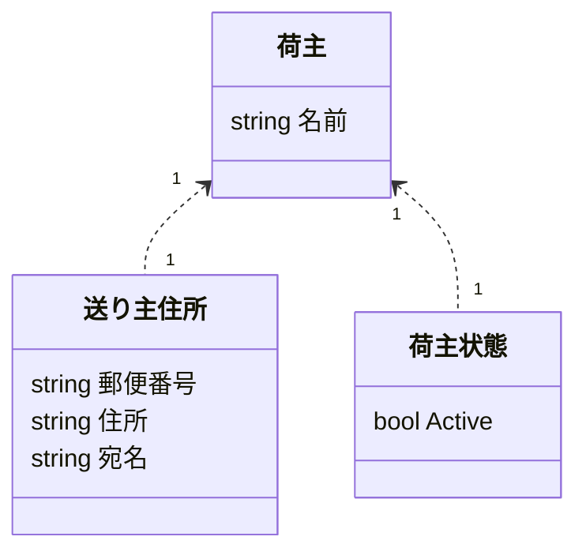
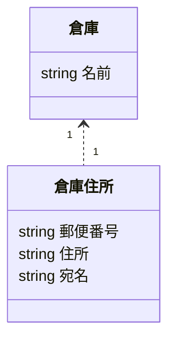
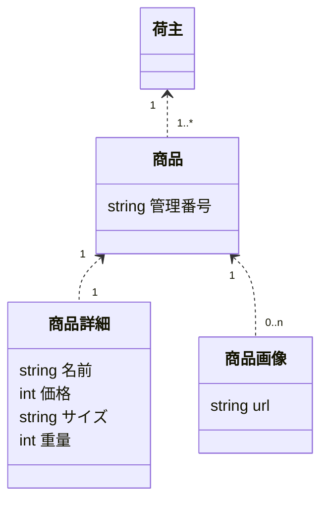
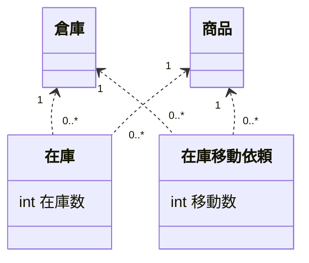
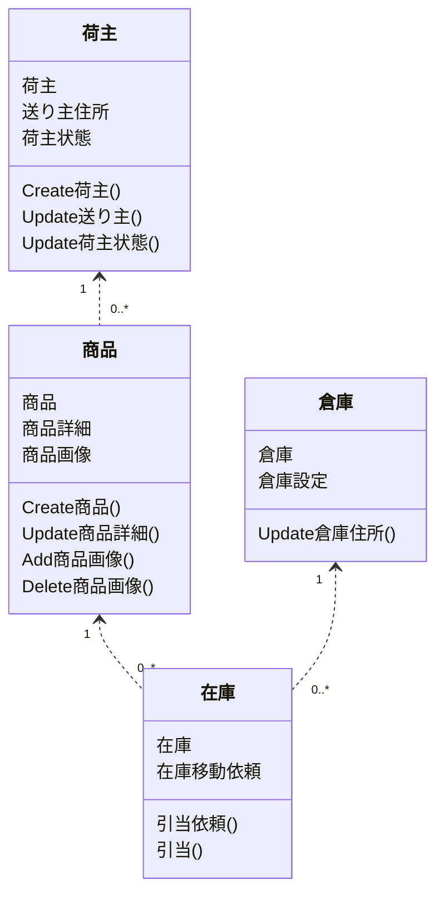
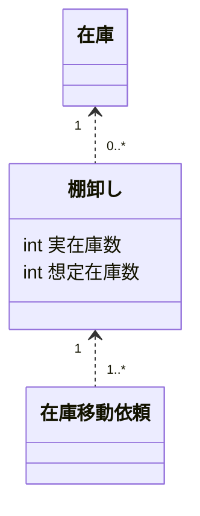
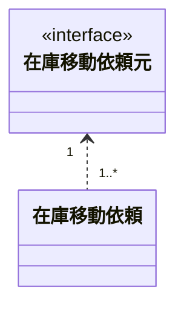
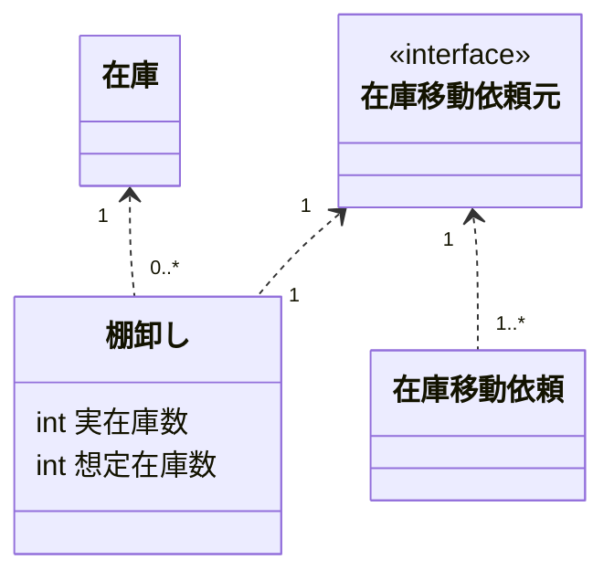

[OPENLOGIアドベントカレンダー2025](https://qiita.com/advent-calendar/2025/openlogi)の23日目の記事です。

## 導入

最近なにをしているかというと、上司に許可を取って会社のリポジトリで、開発のトレーニングをしている。  
自分のためなのだが、会社のリポジトリを借りる以上、学んだことは記事にまとめるべきだろう。ちょうど12月である。  
当該のリポジトリは、一般には公開できないが、ある程度かたがついたら社内で説明するつもりだ。  

最近、筆者が興味を持っているのは詳細設計、あるいは分散システム含めたソフトウェアの構造的な問題だ。会社のリポジトリ上でコソコソやっているのもそれに関することだ。  
今回はコソコソやっている中で、Package構成をどう切るか、それを表現するためにUMLのクラス図をどう使うかを記事にしたい。  
これはある程度おおきな規模のコードベースを作る際に、設計の段階で何をすべきかということにフォーカスしている。  
またドメイン駆動設計のエッセンスを借用している。  

## ドメイン駆動設計について
これは普段記事を書くときに、非常に後ろめたいのだが、ドメイン駆動設計についての書籍はほとんど読んだことがない。  
読もうと思っているが時間が取れていない。ただ、qiitaやzenn、ブログ記事などでは触れているので、そこまで間違った認識をもってはいないだろう。  

この記事上で、ドメイン駆動設計から概念を拝借したいのは`集約`だ。  
これは、定義した構造体、あるいはデータモデルのいくつかを一まとまりにしたものと捉えている。  
そして、その一まとまりにできるのは、それらの情報が関連が強く、特定の一貫したライフサイクルを持ち、一まとまりで扱いやすいものであるとも考えている。  

この集約の単位で構造を決め、その構造を表現するためにクラス図を使う。  
なお、集約をどう区切るか、またモデリングをどうするかはこの記事では触れない。あくまで区切ったあとの構成と、どうクラス図で表現するかの記事となる。  

## Packageについて
集約の単位で構造を決めるので、Packageの単位は当然、`集約`で切りたい。  

ところで、この記事に少し関連する内容が、Xで少し盛り上がっていた。  
それについてブログを書いてくれている方もいる。参考にしたい。  
https://rshindo.hatenablog.com/entry/2025/11/28/233308

当該記事で言及しているのは、JavaのSpring FrameworkにおけるPackage構成についてだ。  
Xで盛り上がっていたのは、Package構成を`Package By Layer`とするか、`Package By Feature`とするかだ。  

`Package By Layer`というのは、Controller/Usecase/Repository/Model/Viewといった構造上の役割ごとにPackageを切るということだ。  
反対に`Package By Feature`というのは、構造上の役割ではなく、機能、つまりFeatureごとに切ることだろう。  

これらの議論について結論づけるには、対象のソフトウェアが何を扱うかというのが非常に重要だ。だから、実際の現場でどうするかは、それぞれの技術者が責任もって考えるべきことだろう。  
そしてだからこそ、職業プログラマである筆者は、これらの議論について、白と黒ではなくとも考え方を持っているべきだろう。  

ここで、`集約`というキーワードに戻ってくるのだが、筆者としては`Package By Aggregate`(集約)を推したい。  
どちらかというと`Package By Feature`側の意見だと思うのだが、Feature(機能)というより、ドメインモデルに基づく`集約`にフォーカスしたい。  

ただし、成長していくコードベースを考えると、Layerという構造上の役割も重要だろう。  
したがって、Aggregateの中にLayerのpackageを切る。というのが、筆者個人の考えであり、今回の記事もその構造をどう表現するかを説明する。  

ただ、これらは一つのやり方であり、これを更に細かく区切ることも、あるいは簡易的に扱うこともあり得るだろう。  
あくまで必要な形を見積もり、必要なものを定義するのが職業プログラマの役割だ。  

## UMLのクラス図
ドメイン駆動設計の集約の単位を使って、Package構成を区切るところまで説明した。この構造を利用して、UMLのクラス図も作成する。  
具体的には、特定の集約に閉じたクラス図（詳細クラス図）と、それらすべての集約の関連を示すクラス図（全体クラス図）を作成する。  

これは実際にコードを書き始める前に用意するものだ。だからコードと重複する情報もある。  
ただコードよりは記述する時間がかからず、全体を把握するのに都合がいいので開発前に用意して構造をチェックしたい。  
もしクラス図だけでイメージがつきづらければ、詳細クラス図にはどんどんメモを書き込めばいい。コードを書く前に整理するのが目的なのだ。  
そしてコードと情報が重複するので、詳細クラス図はコードをコミットしたら削除し、全体クラス図のみ残す。  

例を出そう。冒頭で会社のリポジトリでやっていると言ったので、株式会社OPENLOGIのデータモデルを簡略化したものを例示したい。  
OPENLOGIは、物流システムを提供している。ものすごく簡単に言うと倉庫に預けて、出すまでが基本的な守備範囲である。  

データモデリングするとして、以下のような集約は必要だろう。  
- 商品: 預かるもの
- 在庫: 預かっている状態を管理する情報
- 倉庫: 商品をあずかる倉庫さん
- 荷主: 商品を所有するお客様

他にもあるが、多いと整理ができないので、これくらいでいいだろう。  
まずは、これらをそれぞれ一つの集約として、集約内部のモデリングについて、クラス図で表現してみる。  

### 荷主
まずは荷主から。荷主は、OPENLOGIにおいてはお客様と同義なので、アカウントと読み替えてもいい。  

集約の振る舞い
- Create荷主
- Update送り主住所
- Update荷主状態

振る舞いというのは、この集約が提供する機能だ。  
荷主であれば、3つ定義している。  

特定のユースケースにおいて、何をすればいいのかわかりやすくするためにこうしている。  
たとえば、アカウント登録においては、上記3つをすべて行うだろう。  
退会のユースケースでは`Update荷主状態`だけ行う。単純に設定変更できるのは`荷主住所`だけというのも想像しやすい。  

ユースケースから利用するというところからもイメージできる通り、上記の振る舞いはDB操作も含んでいる。  
実際の機能を分解していって、集約という視点に立ったとき、このように定義できるだろうというイメージである。  
いわゆるドメインモデルのメソッドだったり、参照透過な関数ではなく、あくまでReal Worldに作用を及ぼす動作を、集約の振る舞いと呼んでいる。  

また、普通クラス図は、`荷主`や`送り主住所`という単位にメソッドを生やすのだが、それは今回はしていない。  
項目の定義はDB schemaを導くために用意しているが、そのクラスのメソッドはあとから追加されたり、用意してみたら不要だったりと、実装時に検討するでも遅くないと考えているからだ。  
それよりも、その集約の振る舞いを定義し、機能、つまりドメイン駆動設計などで言うところのアプリケーション領域の実装イメージをつけやすくすることが、ここの意図だ。  

### 倉庫
次は、倉庫である。どこに商品を預けるか管理しなくてはならない。  

集約の振る舞い
- Update倉庫住所

荷主はアカウントと同義としたが、つまりはお客様のアクションで作成されるデータである。  
倉庫はOPENLOGIが管理しているものなので、勝手に作ることができない。アプリケーション上で公開すべきふるまいは`Update倉庫住所`のみだ。  
マスターデータ寄りの特徴があると考えるとわかりやすいかもしれない。  

### 商品
最終的に管理すべきは在庫情報なのだが、それらの管理単位は商品であるべきだ。  

集約の振る舞い
- Create商品
- Update商品詳細
- Add商品画像
- Delete商品画像

商品は荷主のものなので荷主に依存している。  
振る舞いについてだが、商品登録のユースケースにおいては、上記3つがすべて呼ばれるだろう。  
だが、これも在庫情報から見ると、マスターデータ寄りの情報である。削除はできず、変更できるのは`商品詳細`と`商品画像`のみなのが想像できる。  

### 在庫

集約の振る舞い
- 引当依頼
- 引当

在庫は特定の商品をどこの倉庫にいくつおいているのか？という情報なので、商品と倉庫に依存している。  

在庫の`在庫移動依頼`は分かりづらいので説明がいるだろう。  
ECにおいて在庫を注文に割り当てることを`引当`というのは割と一般的と考えているが、この引当はシステム的な負荷が高く、OPENLOGIでも難しい処理だ。  
負荷が高いので非同期で処理したいのだが、その場合、いくつ在庫を引き当てたいかという依頼数と在庫数をそれぞれ管理する必要があるため、`在庫移動依頼`という構造体を定義している。  
ちなみに厳密には在庫移動には`引当`以外のものも存在するが、もっとも代表的で負荷の高い処理として`引当`を引き合いに出している。  

集約の振る舞いとしては、`在庫移動依頼`を作る引当依頼があり、それを受けて非同期で引当の処理が走って、在庫数を更新する。  

### 全体
そして、ここまでで、荷主、倉庫、商品、在庫と集約を定義してきたが、それらの関連も示さなくてはならない。  
詳細クラス図でも、別の集約に依存しているものは記載しているが、全体感は知りたいところだ。  

全体クラス図においては、それぞれの集約同士の依存関係が示されている。  
また、それぞれの集約の中の構造体が項目としてあり、先に示した集約の振る舞いも記載されている。  
集約の振る舞いや、集約の中の構造体はすべて書く必要はない。単に全体を俯瞰して、主に何をするのか、イメージをつけやすくするのが目的だからだ。  

ここまでクラス図を説明してきたが、詳細クラス図については対応するコードがコミットされれば削除したい。  
情報としてはコードとほぼ重複していくからだ。でもそちらを削除するからこそ、こちらの全体クラス図は残したいし、主な振る舞いも記載しておきたい。  
また集約同士の関連は、プログラミングコード上でもimport文などを見ればわかることだが、俯瞰で見づらいものだ。  
俯瞰で見えると、プロジェクトの新規参画者が早くキャッチアップできるし、慣れていても全体感に齟齬が出ないか開発中に確認することもできる。  

また開発計画を立てるうえでも、この図は役に立つ。依存関係が明確なので、実装順序もそれに沿えばいいからだ。  

### クラス図以外のドキュメント
ここまでクラス図の説明をしてきたが、他にもwebシステムならrouteingの定義、画面遷移の定義、DBスキーマ設計なども必要になる。  

機能設計でURLなどを先行して定義してもいいのだが、これらの集約の項目と、振る舞いを定義すると、特定のURLに紐づく機能の設計が楽になるだろう。  
特定の機能では、定義した集約とその振る舞いを利用するだけになるからだ。  
機能を先に定義して実装を始めてしまうと、実装時に考えることが増えて混乱するかもしれない。それを防ぐためのクラス図である。  

またDBスキーマや、ユーザインタフェースとなるJSONスキーマも、クラス図から簡単に導ける。別途定義しなくても、コーディングの段階で定義すれば間に合うだろう。  

## Layerについて
Package By Aggregateとしたが、その下にLayerも切ると述べた。それについても言及すべきだろう。  
Layerの切り方は色々とあり、筆者も一家言あるが、それを引き合いにだすと長くなる。  
ここはとりあえず、説明が簡単に済むように以下のように考えたい。  

- Controller  
  ユースケースとしてもいいかもしれない  
  重要なのは、ドメイン領域を利用するアプリケーション領域ということだ  
- Model  
  データモデルの項目を定義し、ロジックなども持つ  
  いわゆるドメインモデルだろう。これはドメイン領域だ。  
- Repository  
  DBアクセスを隠蔽するのにわかりやすい概念だろう  
  これはドメイン領域のものだ  

ドメイン領域はドメインを表現するもの、アプリケーション領域は、ドメインを利用して機能を実現するものと定義しよう。  
AggregateとLayerは、筆者は以下のマトリクスで考えている。  

図の列がAggregate、行がLayerだ。筆者の考えでは、Package By LayerとPackage By Aggregateは、上記の図で横線を優先したか、縦線を優先したかと見ている。  
そして矢印は依存関係を表現している。ControllerはRepositoryを使い、RepositoryはModelを利用している。また集約同士の依存関係もModel部分で表現されているものだ。  

ここでまず疑問に思うべきことは、Controllerの扱いだろう。  
筆者もControllerはアプリケーション領域と定義した。その上で、ドメイン領域である集約の中のPackageとしている。  
こうしている理由として筆者は、特定のControllerの機能は、特定の集約を話題の中心として機能を提供する傾向があると考えているからだ。  

たとえば、在庫を増やす処理では、`誰(荷主)`のどの`商品`をどの`倉庫`において増やすのかという情報が必要になる。  
中心となるのは間違いなく`在庫`だろうが、他の集約の情報も必要なのである。だが、この機能は`荷主`集約に実装するのは不自然な気がする。`在庫`集約が妥当だろう。  
図においても在庫Controllerは、商品と倉庫Repositoryを参照している。  

こういった形で、中心となる集約があるだろうということだ。また、それに迷うようであれば、集約の切り分け方に問題がある可能性もある。  
こういった考えに基づけば、アプリケーション領域のコードを、特定の集約Packageに入れ込むのも悪くないと考える。  
また、仮にアプリケーション領域とドメイン領域で分けようとすると、ディレクトリはもう一段深くなるだろう。それもまた面倒だ。  

## クラス図についての学び
ここまでPackageの切り方、集約の表現としてクラス図を用いることについて述べてきた。  
クラス図を書いていていくつか学びがあったので、コツとして記しておきたい。  
クラス図の書き方みたいな本があれば、おそらく載っているような内容だろう。  

### 依存関係の方向
クラス図において、依存関係の方向の方向は一方向にすべきだ。  
そして一方向にならないのであれば、何かしら工夫すべきだ。  

この記事で例示したクラス図はあまり複雑ではないが、実際にはクラス図の構造体の依存関係が循環してしまうこともあるかもしれない。  
これは、実装時に何が前提条件となる情報なのかわかりづらくなるので良くない。  

循環する場合は、共通の構造体、あるいはインタフェースを定義すると循環を防ぐことができる。  

たとえば、棚卸しという機能を考えてみる。
棚卸しというのは、倉庫にある在庫数を数え上げて、本当にデータと実数が一致しているかチェックする業務だ。  
そして棚卸しをうけて、データ上の在庫数を調整することもある。この関係をクラス図で表すと以下となる。  

棚卸しを起因として、在庫数を増減させるのであれば、`在庫移動依頼`から`棚卸し`を参照することになるだろう。  
構造体の視点では、依存関係は一定方向だ。だが、集約同士の視点では、`在庫移動依頼`も`在庫`も在庫集約なので、棚卸し集約と依存が循環している。  
棚卸し集約は、在庫集約に依存しているのか？あるいは逆か？  

たとえば、在庫に以下のようなinterfaceを用意するとどうだろうか。

こうすると、棚卸しの集約は以下のように表現できる。

これで集約の視点においても、依存が循環しなくなる。  
interfaceを挟むのは誤魔化しているだけのように見えるが、`在庫移動依頼`からは`棚卸し`を意識せずに実装できるので、実際にコードが整理しやすくなる。  
筆者はinterfaceというのはフレームワークで提供されるもののイメージでいたが、本来はこういうふうに使うのだろう。  

また、このinterfaceに情報を持たせたくなったら、実態のある構造体としてもいい。どちらも同様の関連を提供できる。  
interfaceでも構造体であっても中間の抽象オブジェクトを用意したので、`在庫移動依頼`の理由は、`棚卸し`に限らず、`注文`や`入荷`などを抽象的に扱えるようになる。  
こういった中間のオブジェクトは非常に便利である。  

### 項目数
筆者が現在仕事で向き合っている構造体の項目数は100を超えている。  
項目数はなるべく少なくしたほうがいいだろう。  

この項目数が多い場合は、構造体を分けたほうがいい。  
集約内部でも依存関係がわかりやすければ、実装時に何から実装すればいいかわかりやすいだろう。  

上記の`商品`集約でも`商品詳細`を分離している。  
`商品詳細`は`商品`のほうが前提として先に存在すべきだというのは図から読み取れるし、操作時も`商品詳細`のみを操作しやすい。  
またフラットに100項目あると、100項目同士の関連でPathが無限に増えていく。これを構造体にわければ、構造体ごとのPathで依存関係が示せるのでわかりやすい。  

## まとめ
今回ははどんなふうにUMLを書き、それを受けてPackage構成をどうするかという話題で記事を書いた。またそれらを検討する際のキーワードは`集約`である。  
この記事で例示したもの程度であれば、UMLをふくめた詳細設計の資料などなくても作れるかもしれない。ただ、実際のプロダクトコードはもっと複雑で、俯瞰する情報を得てコードに潜るほうが理解が早い。  
大きなものを作るのであれば、参考になることもあるかもしれない。  

また、言語に依存しない文脈で説明してきたが、これらを表現するGoのテンプレートプロジェクトを自分のアカウントに作っている。  
ただ、会社のアカウントでこれを実践する中で、修正する点も多いので、まだテンプレートとして完成していない。さらに、この記事で説明していない概念もあるので、現状ではわかりづらいものだ。  
今回の記事はいわゆる詳細設計にフォーカスしたもので、開発ライフサイクルの全体像が見えづらいものだが、もしかしたら以下のテンプレートプロジェクトは、全体像を見るのに役に立つかもしれないので、一応貼っておく。  

https://github.com/motojouya/ddd_go

もし、この記事で説明したエッセンスが、読者の役に立つのであれば嬉しい。  

