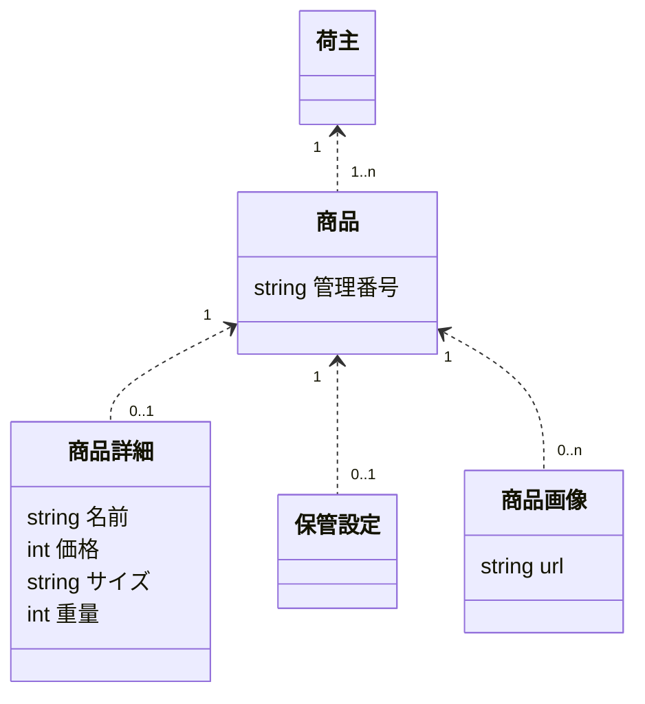
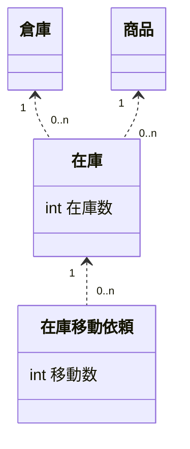
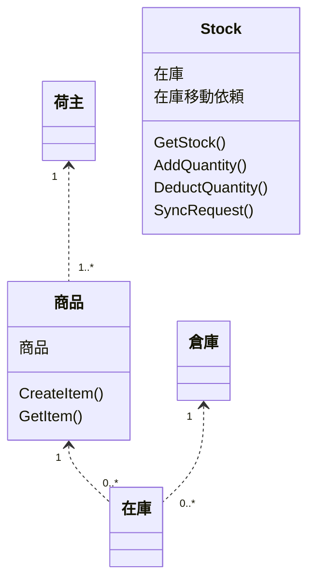

[OPENLOGIアドベントカレンダー2025](url)のN日目の記事です。

## 導入

最近なにをしているかというと、上司に許可を取って会社のリポジトリで、開発のトレーニングをしている。  
自分のためなのだが、会社のリポジトリを借りる以上、学んだことは記事にまとめるべきだろう。ちょうど12月である。  
当該のリポジトリは、一般には公開できないが、ある程度かたがついたら社内にも説明するつもりだ。  

最近、筆者がフォーカスしているのは詳細設計、あるいは分散システム含めたソフトウェアの構造的な問題だ。会社のリポジトリ上でコソコソやっているのもそれに関することだ。  
今回はその中でドメイン駆動設計をどう使うか、それをUMLでどう表現するかという話題で記事を書く。  

ところで、この記事に少し関連する内容が、Xで少し盛り上がっていた。  
それを見てブログを書いてくれている方もいる。参考にしたい。  
https://rshindo.hatenablog.com/entry/2025/11/28/233308

Xで盛り上がった内容は関係あるとも言えるし、ないとも言えるが、どう関係するかも記事で言及していく。  
筆者の記事では用語の定義から入るので、正直まだ導入は続くのだが容赦してほしい。最初にドメイン駆動設計、Package構成について言及し、本題に移る。  

## ドメイン駆動設計について
これは普段記事を書くときに、非常に後ろめたいのだが、ドメイン駆動設計についての書籍はほとんど読んだことがない。  
読もうと思っているが時間が取れていない。ただ、qiitaやzenn、ブログ記事などでは触れているので、そこまで間違った認識をもってはいないだろう。  

個人的な認識で申し訳ないが、筆者はドメイン駆動設計とは、以下のように考えている。
```
ドメインモデルを定義し、それによって一貫性を持って設計、開発を行うことで、共通認識を持とうとすること。
また、実装モデルをドメインモデルに近づけることで、開発期間や作業者による共通認識の差が生まれないようにすること。
```

ドメインモデルは、実装モデルとは違うだろう。だからこそ、なるべくドメインモデルを表現しやすい構造にすべきだ。  
よくドメイン駆動設計について問題視されるのは、このドメインモデルの検討と、それを表現する実装での工夫がよく見えないことがあるからだろう。  

この記事でも、ドメインモデルをどう定義すべきかという話題には触れない。が、実装での工夫も構造的な部分にしか触れない。  
ドメインモデルを設計上ではどう表現し、ソフトウェアの構造に活かすのか？という話題である。  

その際に、キーワードとしたいのは`集約`だ。  
本当に申し訳ないのだが、書籍の知識が乏しいので`集約`の正確な定義はわからない。  
が、ここではデータとして構造体を定義し、それらの構造体のいくつかを一まとまりにしたものと捉えている。  
そして、その一まとまりにできるのは、それらの情報が関連が強く、共通のライフサイクルを持ち、一まとまりで扱いやすいものであるとも考えている。  

定義は曖昧だが、いくつかの構造体をまとめておくことは、筆者にもできる。この集約の単位を決めて、構造に活かすことが今回の肝だ。  

## Packageについて
導入の部分で紹介したブログがある。当該記事で言及しているのは、JavaのSpring FrameworkにおけるPackage構成についてだ。  
Xで盛り上がっていたのは、Package構成をPackage By Layerとするか、Package By Featureとするかだ。  

Package By Layerというのは、Controller/Usecase/Repository/Model/Viewといった構造上の役割ごとにPackageを切るということだ。  
反対にPackage By Featureというのは、構造上の役割ではなく、機能、つまりfeatureごとに切ることだろう。  

これらの議論について結論づけるには、対象のソフトウェアが何を扱うかというのが非常に大事だ。だから、実際の現場でどうするかは、それぞれの技術者が責任もって考えるべきことだろう。  
そしてだからこそ、職業プログラマである筆者は、これらの議論について、白と黒ではなくとも考え方を持っているべきだろう。  

今回UMLを使ってドメイン駆動設計を表現していくに当たっては、どちらかというと、Package By Featureに当たる。  
ただ、筆者個人としては、機能Featureという単語は、あまりに利用者に向いているような気がしており、データ構造を中心としたドメイン駆動設計からは少し離れた呼び方に感じてしまう。  
感の鋭い読者はわかるとおもうが、筆者としてはFeatureをAggregateに読み替えたい。つまり集約だ。  

ただし、成長していくコードベースを考えると、Layerという構造上の役割も重要だろう。  
したがって、Aggregateの中にLayerのpackageを切る。というのが、筆者個人の考えだ。  
ただ、これらは一つのテンプレートであり、これを更に細かく区切ることも、あるいは簡易的に扱うこともあり得るだろう。  
あくまで必要な形を見積もり、必要なものを定義するのが職業プログラマの役割だ。  

## UMLについて
ここからが本題だ。  
ドメイン駆動設計の集約の単位を使って、Package構成を区切るところまで説明した。この構造を利用して、UMLも書くのである。  
具体的には、集約の単位に閉じたクラス図と、その集約の関連を示すクラス図を作成する。  

例を出そう。冒頭で会社のリポジトリでやっていると言ったので、株式会社OPENLOGIのデータモデルを簡略化したものを例挙したい。  
OPENLOGIは、物流システムを提供している。ものすごく簡単に言うと倉庫に預けて、出すまでが基本的な守備範囲である。

以下のようなものが必要だろう。
- 商品: 預かるもの
- 在庫: 預かっている状態を管理する情報
- 倉庫: 商品をあずかる倉庫さん
- 荷主: 商品を所有するお客様

他にもあるが、出し過ぎると会社の特有の業務知識が漏れるし、多いと整理ができないので、これくらいでいいだろう。
まずは、これらのモデリングについて、クラス図で表現してみる。  

- 商品


- 在庫

TODO 在庫ドメインはテクニックが詰まっていすぎて、詳細に書きづらいが、モデルがひとつなのもさみしいところ。なにか工夫したい。
ZOZOの記事を引き合いに出して、非同期化するのであれば、実在庫数と、それを増減させるrequestのモデルは別にあるべきだろうという想像がつく話はしてもいいはず。

- 倉庫
```mermaid
classDiagram
  class 倉庫 {
    string 名前
    {} 住所
    {} 設定
  }
```


- 荷主
```mermaid
classDiagram
  class 荷主 {
    string 名前
    {} 設定
  }
```

それぞれの集約ごとのクラス図としてはこんな感じだが、実際には設計資料なのでビジネスルールがもっと箇条書きされていたりする。  
そして、これらの集約間の関連も表現しなくてはならないだろう。  

- 全体


ビジネスルールを箇条書きにする以外にも、それぞれのPackageにおいて、なんのLayerを切るか、またControllerレベルにおいては、日本語でプログラムのコードを説明するようなものも書いていたりする。  
その設計資料を持ってLLMに実装してもらっているのだが、なんとなくうまく言っているように思う。集約ごとにPackageをまず切っているので、LLMもどこに何を作ればわかりやすいはずだ。
また、全体の集約同士の関連は依存関係が明確になるので、ここからFish Borne Chartを起こすのも簡単で、作業計画がしやすい。  

Package By Aggregateに切るので、Aggregateごとにドキュメントを用意し、Aggregateごとに実装していくのが自然で、実装ごとにディレクトリが増えるのはわかりやすい。かつ、fish borne chartも。  
その他はXでも様々な書籍でもPackage By Featureのメリットは書かれているので説明は省きたい。ここで重要なのは、クラス図の書き方がPackage構成と同じになるし、そのほうがわかりやすいということ。  

## Layerについて
開発しているリポジトリ上で、Layerをどう切っていくのかについては、かなり独自の考え方を適用している。なので、それだけで一つの記事になるし、それについては追々書きたいと思っている。  
だが、Aggregateの下に切るLayerについての説明はこの記事でも必要だろう。キーワードとしては、パーツがアプリケーション領域に属するか、ドメイン領域に属するかが重要だ。  

ドメイン領域はドメインを表現するもの、アプリケーション領域は、ドメインを利用して機能を実現するものだ。  
よくあるレイヤーを分類すると以下のようになるだろう。  

- Controller
  ユースケースとしてもいいかもしれない
  重要なのは、ドメイン領域を利用するアプリケーション領域ということだ
- Model
  データモデルの項目を定義し、ロジックなども持つ
  いわゆるドメインモデルだろう。これはドメイン領域だ。
- Repository
  DBアクセスを隠蔽するのにわかりやすい概念だろう
  これはドメイン領域のものだ

Package By Aggregateが筆者の考えだと述べたが、それぞれの依存の関係を、Aggregate x Layerで示すとどうなるだろうか。
マトリクスで表現すると、以下のようになる。
- 図

もっとも疑問に思うべきことは、Controllerの扱いだろう。  
筆者もControllerはドメイン領域ではないと定義した。そして実際に上記の図でも、複数のAggregateを利用している。  
ただ、特定のControllerの機能は、特定のAggregateを中心の話題となって機能を提供する傾向があると考えている。  

たとえば、在庫を増やす処理では、`誰(荷主)`のどの`商品`をどの`倉庫`において増やすのかという情報が必要になる。
中心となるのは間違いなく`在庫`だろうが、他の集約の情報も必要なのである。この機能は`荷主`集約に実装するのは不自然な気がする。`在庫`集約が妥当だろう。  
こういった形で、中心となる集約があるだろうということだ。また、それに迷うようであれば、集約の切り分け方に問題がある可能性もある。  
こういった考えに基づけば、アプリケーション領域のコードを、特定の集約Packageに入れ込むのも悪くないはずだ。  

また、Package By Featureには、特定の機能を実装するときに、ディレクトリを深くまたがなくてよいという特徴がある。  
Package By Layerでは、Layerのディレクトリに戻って潜る必要があるが、Package By Featureなら改修するLayerをたどりやすい。  

## 学び
- 依存関係を一方光に
  - そのためのinterface
  - たりなければ実態を
- 一つの構造体に項目がおおければ、分割したい
  - ファイルにコードが増えすぎる
  - 分割してれば、ユースケースを再定義するときにも、分割が簡単に

## まとめ
今回ははどんなふうにUMLを書き、全体的な構成をどうするかという話題で記事を書いた。  
こんなものは、俺の考えた最強の設計でしかないだろう。  
ただ、UMLを書いて整理する、ドキュメントを書く、集約を切るという手法を少し知っていると、複雑なシステムを構築するのに役に立つかもしれない。  
もし、これらのエッセンスが読者の役に立つのであれば、嬉しい。  

